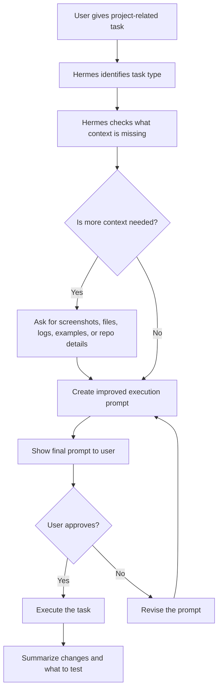

# Hermes Prompt Optimizer Workflow

[](https://skills.sh/brandz0/hermes-prompt-optimizer-workflow/hermes-prompt-optimizer-workflow)
[](https://github.com/nousresearch/hermes-agent)

A Hermes Agent skill that turns project-related requests into clear, approval-based execution prompts before the agent edits, changes, or builds anything.

Built for [NousResearch Hermes Agent](https://github.com/nousresearch/hermes-agent), an open-source AI agent with a skill system.

## Install with skills.sh

To install through the open agent skills CLI, run:

```bash
npx skills add BRANDZ0/hermes-prompt-optimizer-workflow
```

View the indexed skill page here:

```text
https://skills.sh/brandz0/hermes-prompt-optimizer-workflow/hermes-prompt-optimizer-workflow
```

This helps the skill become discoverable on skills.sh because installs through the skills CLI are tracked anonymously by skills.sh.

## Hermes terminal install option

If you prefer installing it as a Hermes skill through the Hermes CLI, run:

```bash
hermes skills install BRANDZ0/hermes-prompt-optimizer-workflow --now
```

Then in Hermes, say:

```text
Use the hermes-prompt-optimizer-workflow skill for this project. For every project-related task, improve the prompt first, ask for missing context if needed, show me the final prompt, and wait for approval before executing.
```

If your current session does not pick it up, start fresh:

```text
/reset
```

## Easy paste setup

If you do not want to use terminal commands, paste this into Hermes:

```text
Read this repo and follow the Hermes Prompt Optimizer Workflow for all project-related tasks:
https://github.com/BRANDZ0/hermes-prompt-optimizer-workflow

Use SKILL.md as the main instruction file.
```

That is enough for most users if Hermes can read the repo link.

## Update later

When this repo gets improved, update the skill with:

```bash
hermes skills check
hermes skills update hermes-prompt-optimizer-workflow
```

If Hermes warns because this is a community GitHub skill, review the repo first. If you trust it, install with:

```bash
hermes skills install BRANDZ0/hermes-prompt-optimizer-workflow --now --force
```

## What Hermes will do

For every project-related task, Hermes should:

1. Identify the task type.
2. Ask for missing context, screenshots, files, logs, or examples.
3. Rewrite the request into a stronger execution prompt.
4. Show the improved prompt to the user.
5. Wait for approval.
6. Execute only after the user approves.

## What this does

Instead of letting Hermes immediately execute vague requests, this workflow makes Hermes pause and improve the task first.

Example request:

```text
fix this mobile ui the buttons look funny
```

Hermes should not start editing right away.

It should first create a better plan/prompt, ask for anything missing, show the final prompt, and wait for approval.

## Workflow chart



## When Hermes should use this

Use this workflow for every project-related task:

| Task type | Examples |
|---|---|
| UI and design | Layout fixes, mobile responsiveness, spacing, colors, component polish |
| Bugs | Broken login, console errors, failed API calls, bad state behavior |
| Features | New pages, buttons, flows, forms, dashboards, settings |
| Refactors | File cleanup, component splitting, safer structure, reusable logic |
| Docs | README files, setup guides, usage docs, repo instructions |
| Deployment | Vercel, Railway, VPS, Netlify, build errors, environment variables |
| Repo tasks | Branch work, cleanup, config files, project organization |
| Prompt writing | Agent prompts, coding prompts, system instructions, task templates |

## Core rule

Hermes should not execute project-related tasks immediately.

Hermes must first optimize the request, ask for missing context when helpful, show the improved prompt, and wait for approval.

## Main files

| File | Purpose |
|---|---|
| `SKILL.md` | Main Hermes skill entrypoint with metadata |
| `COPY_THIS_TO_HERMES.md` | Simple paste-in instructions for Hermes |
| `PROMPT_OPTIMIZER.md` | Full workflow rules |
| `CONTEXT_QUESTIONS.md` | What Hermes should ask before creating the final prompt |
| `EXAMPLES.md` | Before-and-after examples for common project tasks |
| `CHANGELOG.md` | Recent workflow changes and update notes |

## Keeping the workflow updated

This skill tells Hermes to re-read the latest repo files at the start of new chats, project sessions, or repo sessions.

The latest behavior is defined in:

1. `SKILL.md`
2. `README.md`
3. `PROMPT_OPTIMIZER.md`
4. `CONTEXT_QUESTIONS.md`
5. `EXAMPLES.md`
6. `CHANGELOG.md`

## Expected behavior

When installed correctly, Hermes should respond to project tasks like this:

```text
I will optimize this task before executing.

Task type: UI / mobile responsiveness

I need one screenshot of the current mobile UI and the screen size where it looks wrong. After that, I will create the final execution prompt for your approval before making changes.
```

Then after context is provided, Hermes should show something like:

```text
Final execution prompt:

Inspect the mobile button layout and fix spacing, sizing, alignment, and responsiveness issues. Preserve existing functionality. Keep changes small and focused. Test common mobile widths. Do not redesign unrelated sections.

Approve this prompt before I execute?
```

## Recommended approval words

```text
approved
approve and run
yes execute
run it
```

## Recommended default behavior

Hermes should always:

- preserve existing functionality
- avoid large rewrites unless needed
- ask for screenshots on UI tasks
- ask for logs on bug or deployment tasks
- inspect relevant files before repo edits
- keep changes focused
- summarize what changed
- tell the user what to test
- avoid exposing secrets, tokens, keys, or private data

## Not a prompt marketplace

This repository is not a prompt marketplace and does not copy private prompts from any service.

It is an open workflow pattern for making Hermes Agent pause, gather context, improve the task, request approval, and then execute safely.

## Best use case

This works best for people who use Hermes Agent or coding agents and want more control before the agent makes changes.

Ideal for:

- Hermes Agent skills
- Hermes project workflows
- Claude Code style workflows
- Cursor-style workflows
- Codex-style workflows
- repo-specific AI instructions
- team prompt standards
- reusable AI operating procedures

## License note

Use and modify this workflow for your own projects. Do not include secrets, private repo details, or personal information when sharing it publicly.
