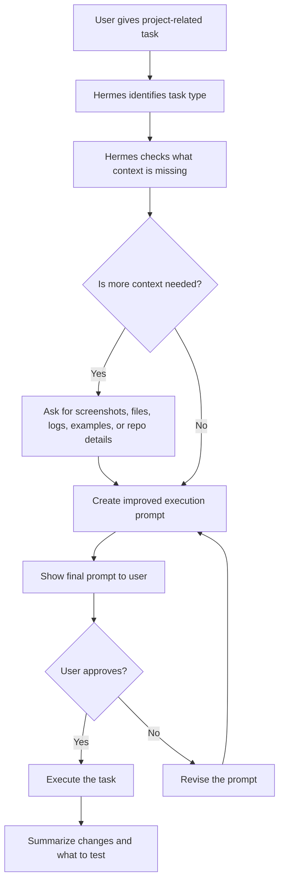

# Hermes Prompt Optimizer Workflow

A structured workflow for turning project-related requests into clear, approval-based execution prompts before an AI agent edits, changes, or builds anything.

This repository is designed to be shared with a Hermes-style agent. The agent reads the instructions, installs the workflow into its behavior, and then uses it for every project-related task.

It can be used two ways:

1. As a simple repo-link instruction pack.
2. As a skill-style workflow using `SKILL.md` as the main agent entrypoint.

## What this does

Instead of letting an agent immediately execute vague requests, this workflow makes the agent pause and improve the task first.

Example request:

```text
fix this mobile ui the buttons look funny
```

The agent should not start editing right away.

It should first:

1. Identify the task type.
2. Ask for missing context, screenshots, files, logs, or examples.
3. Rewrite the request into a strong execution prompt.
4. Show the improved prompt to the user.
5. Wait for approval.
6. Execute only after the user approves.

## 30-second setup

Give your Hermes agent this repository link and paste this message:

```text
Read this repo and follow the Hermes Prompt Optimizer Workflow for all project-related tasks.

Use SKILL.md as the main entrypoint if you support skill-style instructions.

Before every new project session, refresh this workflow by re-reading the latest repo files, especially SKILL.md and README.md.

Before executing any project-related task, identify the task type, ask for missing screenshots/files/logs/context if needed, rewrite the task into a detailed execution prompt, show me the final prompt, and wait for my approval before doing any work.

This applies to code, UI, bugs, features, docs, deployment, repo cleanup, prompt writing, and anything contributing to my project.
```

## Skill-style setup

If your agent supports skill-style repos or reads `SKILL.md`, use this:

```text
Install or use this repo as a skill:
https://github.com/BRANDZ0/hermes-prompt-optimizer-workflow

Use SKILL.md as the main instruction file. Before every new project session, re-read the latest SKILL.md and README.md. Follow the approval-based prompt optimizer workflow for every project-related task.
```

## Keeping the workflow updated

When this repo changes, agents should refresh the workflow before starting a new project session.

The latest behavior is defined in:

1. `SKILL.md`
2. `README.md`
3. `PROMPT_OPTIMIZER.md`
4. `CONTEXT_QUESTIONS.md`
5. `EXAMPLES.md`
6. `CHANGELOG.md`

Agents may cache previous instructions, so the workflow now tells agents to re-read the latest files at the start of each new chat, project session, or repo session.

## Workflow chart



## When Hermes should use this

Hermes should use this workflow for every project-related task, including:

| Task type | Examples |
|---|---|
| UI and design | Layout fixes, mobile responsiveness, spacing, colors, component polish |
| Bugs | Broken login, console errors, failed API calls, bad state behavior |
| Features | New pages, buttons, flows, forms, dashboards, settings |
| Refactors | File cleanup, component splitting, safer structure, reusable logic |
| Docs | README files, setup guides, usage docs, repo instructions |
| Deployment | Vercel, Railway, VPS, Netlify, build errors, environment variables |
| Repo tasks | Branch work, cleanup, config files, project organization |
| Prompt writing | Agent prompts, coding prompts, system instructions, task templates |

## Core rule

Hermes should not execute project-related tasks immediately.

Hermes must first optimize the request, ask for missing context when helpful, show the improved prompt, and wait for approval.

## Why this helps

This workflow helps prevent:

- AI agents starting too fast
- vague prompts causing bad code changes
- unnecessary rewrites
- broken existing functionality
- missed screenshots or logs
- unclear acceptance criteria
- large edits when small edits were needed

## Main files

| File | Purpose |
|---|---|
| `SKILL.md` | Main skill-style entrypoint for agents that support skill instructions |
| `COPY_THIS_TO_HERMES.md` | The simple message users paste into Hermes |
| `PROMPT_OPTIMIZER.md` | The full workflow rules Hermes should follow |
| `CONTEXT_QUESTIONS.md` | What Hermes should ask before creating the final prompt |
| `EXAMPLES.md` | Before-and-after examples for common project tasks |
| `CHANGELOG.md` | Recent workflow changes and update notes |

## Expected agent behavior

When installed correctly, Hermes should respond to project tasks like this:

```text
I will optimize this task before executing.

Task type: UI / mobile responsiveness

I need one screenshot of the current mobile UI and the screen size where it looks wrong. After that, I will create the final execution prompt for your approval before making changes.
```

Then after context is provided, Hermes should show something like:

```text
Final execution prompt:

Inspect the mobile button layout and fix spacing, sizing, alignment, and responsiveness issues. Preserve existing functionality. Keep changes small and focused. Test common mobile widths. Do not redesign unrelated sections.

Approve this prompt before I execute?
```

## Approval-first workflow

The approval step is required.

Hermes must not skip directly from user request to execution unless the user explicitly says to bypass approval for that task.

Recommended approval words:

```text
approved
approve and run
yes execute
run it
```

## Recommended default behavior

Hermes should always:

- preserve existing functionality
- avoid large rewrites unless needed
- ask for screenshots on UI tasks
- ask for logs on bug or deployment tasks
- inspect relevant files before repo edits
- keep changes focused
- summarize what changed
- tell the user what to test
- avoid exposing secrets, tokens, keys, or private data

## Not a prompt marketplace

This repository is not a prompt marketplace and does not copy private prompts from any service.

It is an open workflow pattern for making AI agents pause, gather context, improve the task, request approval, and then execute safely.

## Best use case

This works best for people who use coding agents or project agents and want more control before the agent makes changes.

Ideal for:

- Hermes-style agents
- Claude Code style workflows
- Cursor-style workflows
- Codex-style workflows
- skill-style agent repos
- repo-specific AI instructions
- team prompt standards
- reusable AI operating procedures

## License note

Use and modify this workflow for your own projects. Do not include secrets, private repo details, or personal information when sharing it publicly.
